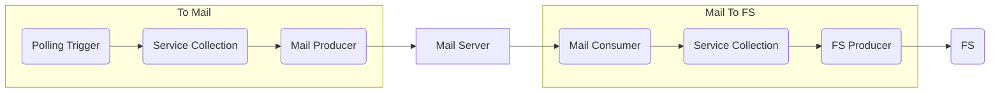

# Mail Testing

[](https://github.com/interlok-testing/testing_mail/blob/develop/LICENSE)
[](https://github.com/interlok-testing/testing_mail/actions/workflows/gradle-build.yml)

Project tests interlok-mail features

## What it does

This project is very simple and contains two channels with one workflow each.

The first workflow has a polling trigger that produces a message every 30 seconds and publish it to a Mail box.

The second workflow is checking new message every 30 seconds on the mail box and copy the message on the file system.



## Getting started

Before starting Interlok you need to create a Kafka docker container with

* `docker-compose up`

Then start Interlok

* `./gradlew clean build`
* `(cd ./build/distribution && java -jar lib/interlok-boot.jar)`

The config is using a variables.properties to configure the mail host, credentials and the file system directory.

```
emailHost=gmail.com
fromEmail=interlok.testing+from@${emailHost}
fromPassword=SomePassword
toEmail=interlok.testing+to@${emailHost}
toPassword=SomePassword
smtpPort=587
smtpUrl=smtp://smtp.${emailHost}:${smtpPort}
imapPort=993
imapUrl=imap://imap.${emailHost}:${imapPort}/INBOX
fsDir=file://localhost/./messages/in
```

For simplicity I chose to use Gmail but any mail provider supporting **SMTP** and **IMAP** or **POP3** can be used.
